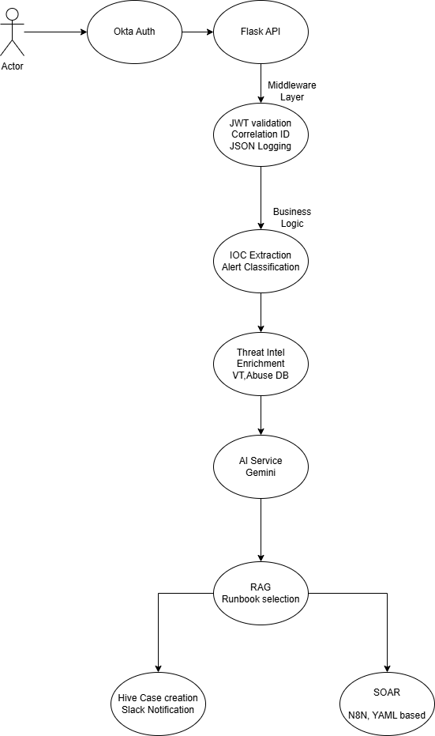

# AI-Powered Security Alert Triage

## What It Does
Automatically classifies security alerts using multi-source threat intelligence and AI, with enterprise authentication and full observability.

## Demo
[Insert 30-second description of what happens when you submit an alert]

## Architecture


## Key Features

### Security
- **Okta OAuth 2.0**: Enterprise SSO with MFA support
- **JWT tokens**: Stateless API authentication
- **Protected endpoints**: All operations require authentication

### Intelligence  
- **Multi-source enrichment**: AbuseIPDB + VirusTotal
- **AI classification**: Gemini with contextual reasoning
- **Semantic search**: ChromaDB RAG for runbook retrieval

### Observability (★ This is your strength)
- **JSON structured logging**: Machine-parseable, ELK-ready
- **Correlation IDs**: Every request traced end-to-end
- **Performance tracking**: Duration logged per operation
- **Full context**: `request_id`, `user_id`, `timestamp` in every log

Example log trace:
```json
{"request_id": "abc-123", "user_id": "admin", "message": "IOC extraction started"}
{"request_id": "abc-123", "user_id": "admin", "message": "Threat intel lookup"}
{"request_id": "abc-123", "user_id": "admin", "message": "AI classification"}
{"request_id": "abc-123", "duration_ms": 51107, "status_code": 200}
```

### Automation
- **SOAR playbooks**: YAML-based incident response workflows
- **N8N integration**: Separate IAM automation workflows (Okta, AWS)
- **Slack notifications**: Real-time alerting
- **GitOps**: N8N workflows backed up to Git daily
## Quick Start

### Prerequisites
```bash
Python 3.9+
Okta developer account
API keys: Gemini, AbuseIPDB, VirusTotal
```

### Setup
```bash
# 1. Clone repo
git clone [your-repo]

# 2. Install dependencies  
pip install -r requirements.txt

# 3. Configure environment
cp .env.example .env
# Add: OKTA_CLIENT_ID, OKTA_SECRET, GEMINIKEY, etc.

# 4. Run
python test/flask_test.py
```

### Test API
```bash
# 1. Authenticate (browser)
http://localhost:5000/login

# 2. Get JWT token (from callback)

# 3. Submit alert
curl -X POST http://localhost:5000/analyze \
  -H "Authorization: Bearer YOUR_TOKEN" \
  -H "Content-Type: application/json" \
  -d '{
    "alert": {
      "source_ip": "185.220.101.52",
      "user": "test@company.com",
      "failed_logins": 8
    }
  }'
```

## Design Decisions

**Q: Why Okta OAuth instead of basic auth?**  
A: Enterprise SSO ready. MFA built-in. Scales to thousands of users. Real-world production pattern.

**Q: Why JSON logging with correlation IDs?**  
A: Distributed tracing foundation. In production, these logs go to ELK/Splunk. Correlation IDs let you trace a request across microservices. This is how you debug production issues.

**Q: Why ChromaDB for runbooks?**  
A: Semantic search > keyword matching. Analysts describe problems in natural language, system finds relevant runbooks automatically.

**Q: Why YAML playbooks instead of N8N for SOAR?**  
A: Separation of concerns. Alert response playbooks are version-controlled YAML with Python executor for flexibility. N8N is used separately for IAM automation workflows (Okta user lifecycle, AWS IAM management) where visual workflow editor adds value.

## What I'd Add for Production

**Week 1**:
- Rate limiting (Flask-Limiter)
- Circuit breakers for external APIs
- Redis for distributed caching

**Month 1**:
- Extract threat intel to separate service (it's the bottleneck)
- Prometheus metrics + Grafana dashboards
- Celery workers for async processing

**Quarter 1**:
- Kafka event bus (true event-driven)
- Multi-region deployment
- API gateway (Kong/Nginx)

## Performance
- Average processing: 2-5 seconds per alert
- TI cache hit rate: 70%+
- AI cache hit rate: 85%+
- Cost per alert: ~$0.003

## Project Structure

├── ai_projects/          # Core alert processing
├── src/
│   ├── middleware/       # Auth, logging, correlation
│   ├── integrations/     # External service wrappers
│   └── logger_config.py  # JSON logging setup
├── test/flask_test.py    # Main API server
├── docs/                 # Architecture diagrams
└── data/playbooks/       # YAML SOAR playbooks

## Technologies
- **Backend**: Flask, Python 3.9
- **Auth**: Okta OAuth 2.0, Flask-JWT-Extended
- **AI**: Google Gemini 2.5
- **Vector DB**: ChromaDB
- **Automation**: N8N
- **Logging**: python-json-logger
- **Integrations**: AbuseIPDB, VirusTotal, Slack

## Contact
